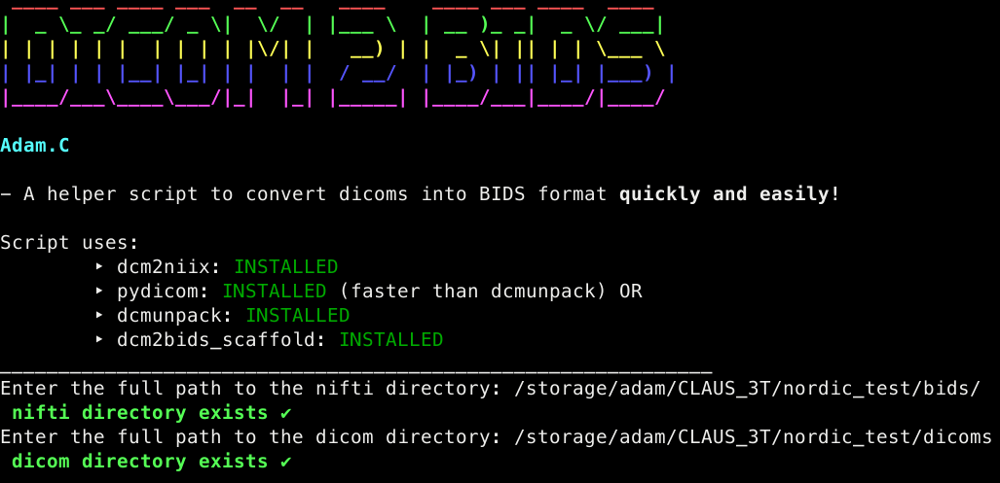

# DICOM 2 BIDS

> For use with MRI data

---

Release notes (version 2.5)

- Add a check for the nifti directory when the dicom directory does not contain any session folder
  > Ensures that the dicoms are unpacked to the correct session folder for subjects with multiple sessions

---

- Convert dicoms to BIDS using dcm2niix and without the need of a `.json` configuration file

- Script converts all dicoms and then leads the user through a renaming and moving files process

- Script adds the intended for field to the fieldmap `.json`

- The script aims to be a precursor to fMRIprep

- Any missing dependencies are installed as needed.

- `pydicom.py` is a script to probe dicoms and to get useful information (this step is not necessary but the information is useful to refer to later)

- Useful information is provided to the user about the BIDS format structure before the renaming takes place

- The user is able to change the names of the nifti files (this is automatically applied to the accompanying `.json`)

## Installation

1. Clone repo
   `git clone https://github.com/adam-coates/dicom2bids.git`

2. Ensure that [dcm2niix](https://github.com/rordenlab/dcm2niix) is installed

3. The python module `pydicom` and `jq` are automatically installed if not already found

## Steps

1. Point to DICOM and BIDS directories

2. Select the DICOM folder

   2a. Optionally select sub folder (e.g. ses-1/ses-\*)

3. Rename the BIDS subject name (the script tries to derive the subject name itself although this is wrong and DICOM folders names vary)

4. Pydicom (or dcmunpack) will scan the DICOM directory and output a useful `.txt` file about the DICOM name and path

5. DICOMS are roughly unpacked into the subject folder

6. Keep the name of the nifti/ modify it or delete it

   7. If keeping the nifti name the script will ask the user whether to modify its folder name or keey it

8. If `fmap` folder present the script will try and create an `IntendedFor` `.json` field entry and list the `func` files

   - An additional text file is created for the `IntendedFor` field that is BIDS uri compliant

 always double check the conversion afterwards for any mistakes
